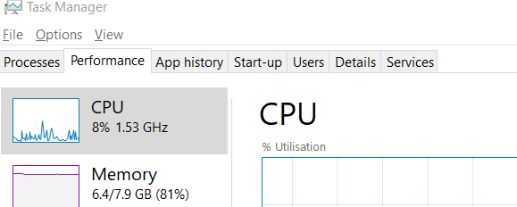
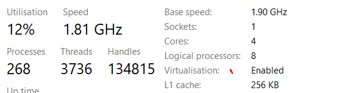

# Installation 
- Download Oracle Virtualbox : https://www.virtualbox.org/wiki/Downloads
- Download vagrant : https://www.vagrantup.com/downloads
- Enable Virtualisation: 
  easy check in windows10 : Go to Task-manager>cpu check the bottom part section of graph 
  - 
  - 
  ```
  git checkout https://github.com/NarendranathPanda/my-vagrant-demo.git
  cd my my-vagrant-demo/node
  vagrant up 
  vagrant status
  vagrant ssh 
  
  //Should be in the new machine
  
  ```
  
  
# Learning Vagrant setup 
https://blog.jeffli.me/blog/2016/12/06/a-beginners-guide-for-vagrant/
https://blog.jeffli.me/blog/2017/04/22/vagrant-networking-explained/

https://www.vagrantup.com/docs/multi-machine

- Vagrant : https://www.vagrantup.com/

- Box: https://app.vagrantup.com/boxes/search

- Provider: https://www.virtualbox.org/wiki/Downloads
VMware Fusion, Hyper-V and QEMU ,docker

- Provisioner: https://www.ansible.com/
 Ansible, Puppet, SaltStack and Chef.
 
- Vagrant file : https://www.vagrantup.com/docs/vagrantfile 


# Virtualbox Networking: https://www.virtualbox.org/manual/ch06.html

- Public networking attaches virtual machines to the same subnet with the Vagrant host
- Private networking hides virtual machines from the outside of the Vagrant host
- Forwarded ports create tunnels from virtual machines to outside world


# The Usual Home Network
---------------------------


# The Public Networking
---------------------------
https://www.vagrantup.com/docs/networking/public_network


# The Private Networking
---------------------------
https://www.vagrantup.com/docs/networking/private_network


# The PORT Forwarding : 
----------------------------
https://www.vagrantup.com/docs/networking/forwarded_ports


